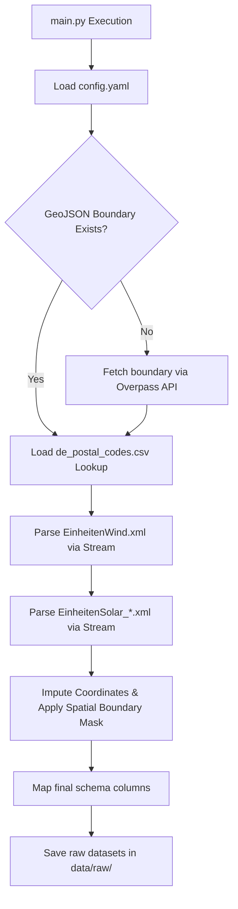

# Checkpoint 01: Environment Initialization, Boundary Fetching, and Streaming XML Parser

**Date**: 2026-06-12  
**Project**: Brandenburg Energy Forecast System (Bachelor's Thesis)  
**Cooperation**: RITS Project

---

## 1. Objectives Completed

In this initialization phase, we established a clean, reproducible ingestion pipeline using `uv`, fetched Brandenburg's boundary, and processed raw Marktstammdatenregister (MaStR) bulk data memory-safely.

### Step 1: Environment & Dependency Alignment
* Synced the declarative environment using `uv sync`.
* Aligned dependencies including `pandas`, `geopandas`, `shapely`, `pyyaml`, `lxml`, `tqdm`, `pydantic`, and `requests` in [pyproject.toml](file:///home/ced/bachelor/final/pyproject.toml).

### Step 2: Configuration Enhancements
* Modified [config.yaml](file:///home/ced/bachelor/final/conf/config.yaml) to dynamically handle paths to raw local datasets:
  * `marktstammdatenregister.wind.local_path`: `"data/mastr/gesamtdaten/EinheitenWind.xml"`
  * `marktstammdatenregister.solar.local_path`: `"data/mastr/gesamtdaten"`

### Step 3: Geographic Boundary Setup
* Created [boundary_fetcher.py](file:///home/ced/bachelor/final/src/data/boundary_fetcher.py).
* Programmatically queried the Overpass API for Relation ID `62504` (State of Brandenburg) to obtain the administrative boundary.
* Reconstructed the complex outer boundary lines and inner exclusions (holes) into a single unified polygon and saved it to `data/external/brandenburg_boundary.geojson`.

### Step 4: Streaming Parser Pipeline
* Created [mastr_bulk_parser.py](file:///home/ced/bachelor/final/src/data/mastr_bulk_parser.py).
* **Memory-Safe Iterator**: Integrated `xml.etree.ElementTree.iterparse` to read large XML files node-by-node.
* **Progress Bar**: Wrote a custom file wrapper `ProgressFile` to feed real-time byte-read progress to `tqdm` for smooth progress feedback over massive files.
* **Garbage Collection**: Invoked `elem.clear()` and `root.clear()` inside the parsing loop to remove parsed tags from Python's memory hierarchy immediately after extraction.

### Step 5: Geospatial Imputation & Masking
* Implemented double-layered coordinate fallback:
  1. If coordinates are missing, cross-reference the unit's postal code against `data/external/de_postal_codes.csv` (downloaded from WZB).
  2. If the zip lookup is missing, assign the mathematical centroid of Brandenburg (`52.348° N, 13.012° E`).
* Used `GeoPandas` to execute a point-in-polygon check (`gdf.geometry.within`), pruning assets that physically lie outside the borders of Brandenburg.

### Step 6: Direct Schema Mapping
* Mapped XML values directly to compliant data schemas from the config:
  * **Wind Columns**: `unit_mastr_number`, `last_update_date`, `longitude`, `latitude`, `commissioning_date`, `final_decommission_date`, `gross_power`, `net_nominal_power`, `manufacturer`, `technology`, `type_designation`, `hub_height`, `rotor_diameter`.
  * **Solar Columns**: `unit_mastr_number`, `last_update_date`, `longitude`, `latitude`, `commissioning_date`, `final_decommission_date`, `gross_power`, `net_nominal_power`, `is_ground_mounted`, `azimuth`, `tilt`, `has_battery_storage`.
* Catalog conversions:
  * `is_ground_mounted` $\rightarrow$ Evaluated true for `ArtDerSolaranlage` = `'852'`.
  * `azimuth` $\rightarrow$ Translated directions (`695`-`702`) to angular degrees ($0^\circ$-$315^\circ$).
  * `tilt` $\rightarrow$ Translated tilt intervals (`806`-`810`) to numeric midpoint degrees.
  * `has_battery_storage` $\rightarrow$ Mapped from binary status `SpeicherAmGleichenOrt`.

---

## 2. Ingestion Pipeline Orchestration

The steps are wired sequentially into [main.py](file:///home/ced/bachelor/final/main.py):

---

## 3. Pipeline Run Validation Results

Execution completed successfully with the following outputs:

| File Target | Record Count | File Size on Disk | Status |
| :--- | :--- | :--- | :--- |
| **Wind Turbines** ([mastr_wind_brandenburg_raw.csv](file:///home/ced/bachelor/final/data/raw/mastr_wind_brandenburg_raw.csv)) | 4,147 active assets | ~489 KB | Saved Successfully |
| **Solar PV** ([mastr_solar_brandenburg_raw.csv](file:///home/ced/bachelor/final/data/raw/mastr_solar_brandenburg_raw.csv)) | 174,336 active assets | ~18 MB | Saved Successfully |

All outputs conform exactly to the schemas defined under `processing` in our configuration profiles.
