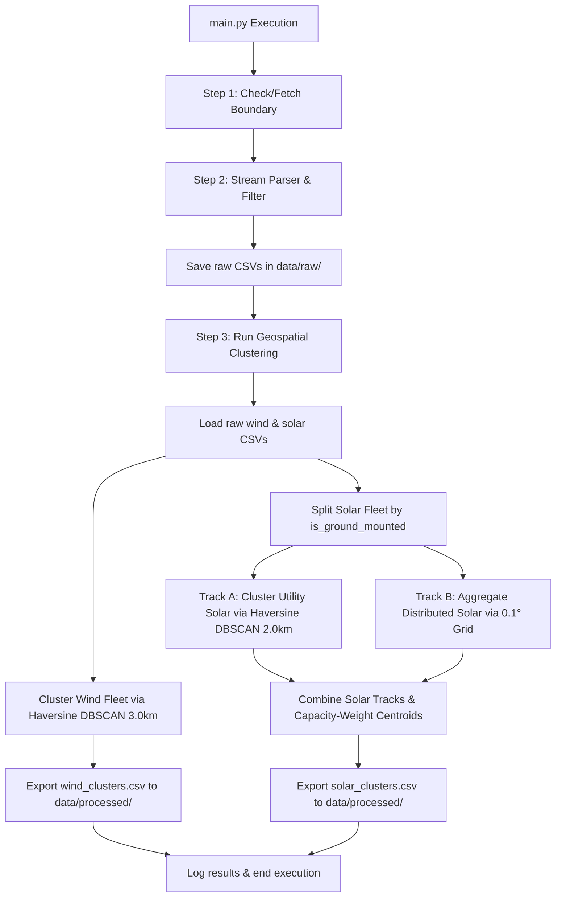

# Checkpoint 02: Geospatial Clustering Pipeline and Weather API Centroid Optimization

**Date**: 2026-06-12  
**Project**: Brandenburg Energy Forecast System (Bachelor's Thesis)  
**Cooperation**: RITS Project

---

## 1. Objectives Completed

In this phase, we designed and implemented a modular geospatial clustering pipeline to consolidate solar and wind assets into meteorologically representative centroids. This optimization ensures a high-fidelity weather mapping while reducing the downstream Open-Meteo API query load.

### Step 1: Environment & Dependency Validation
* Confirmed that `scikit-learn`, `numpy`, `geopandas`, and `shapely` are fully synced and functional under the `uv` environment.

### Step 2: Modular Clustering Engine
* Created [geospatial_clustering.py](file:///home/ced/bachelor/final/src/features/geospatial_clustering.py) within `src/features/` to house the clustering algorithms and data orchestration logic.

### Step 3: Wind Fleet Track (Spherical DBSCAN)
* **Coordinate Conversion**: Transformed latitudes and longitudes to radians to satisfy the constraints of non-Euclidean spherical metrics.
* **Haversine Distance Mapping**: Formulated the search radius epsilon ($\epsilon$) relative to the Earth's mean radius ($R \approx 6371.0088 \text{ km}$) to resolve latitude-based spatial compression:
  $$\epsilon = \frac{d}{R}$$
  where $d = 3.0 \text{ km}$ (retrieved from `open_meteo.cluster_radius_km` in [config.yaml](file:///home/ced/bachelor/final/conf/config.yaml)).
* **Asset Clustering**: Set `min_samples=1` to guarantee that every wind turbine belongs to a cluster (no noise points).
* **Capacity-Weighted Centroiding**: To locate the virtual meteorological station where power capacity is concentrated, centroids are computed using `gross_power` as weights:
  $$\text{Lat}_{\text{centroid}} = \frac{\sum_i \phi_i \cdot P_i}{\sum_i P_i}, \quad \text{Lon}_{\text{centroid}} = \frac{\sum_i \lambda_i \cdot P_i}{\sum_i P_i}$$
  where $P_i$ is the capacity (kW) and $(\phi_i, \lambda_i)$ are the coordinates of turbine $i$.

### Step 4: Solar Fleet Dual-Track Strategy
* **Track A (Utility-Scale)**: Ground-mounted systems (`is_ground_mounted == True`) are isolated and clustered using DBSCAN with a strict $2.0 \text{ km}$ radius ($\epsilon = 2.0 / R$) to keep separate solar farms distinct. Capacity-weighted centroids are computed for each cluster.
* **Track B (Distributed/Rooftop)**: Millions of rooftop systems (`is_ground_mounted == False`) are mapped onto a static geographic grid by rounding latitudes and longitudes to the nearest $0.1^\circ$ weather grid resolution (configured under `open_meteo.grid_resolution`):
  $$\phi_{\text{grid}} = \text{round}\left(\frac{\phi}{0.1}\right) \times 0.1, \quad \lambda_{\text{grid}} = \text{round}\left(\frac{\lambda}{0.1}\right) \times 0.1$$
  Rooftop capacities are aggregated per grid cell, and the cell center serves as the centroid.

### Step 5: Output Consolidation
* Consolidated and exported the optimized centroids to the `data/processed/` directory:
  * `wind_clusters.csv` (Columns: `cluster_id`, `centroid_lat`, `centroid_lon`, `total_capacity_mw`, `asset_count`)
  * `solar_clusters.csv` (Columns: `cluster_id`, `centroid_lat`, `centroid_lon`, `total_capacity_mw`, `asset_count`, `track_type`)

### Step 6: Orchestration Integration, Smart Skipping, & Logging
* Modified [main.py](file:///home/ced/bachelor/final/main.py) to check for existing raw parsed MaStR datasets (`mastr_wind_brandenburg_raw.csv` and `mastr_solar_brandenburg_raw.csv`). If they are already present on disk, the XML parser stage is skipped to optimize pipeline execution speed.
* Configured the system to trigger `run_geospatial_clustering` directly following checking/parsing.
* Implemented detailed log reporting to output active cluster counts for each asset class at runtime.

---

## 2. Integrated Pipeline Flow

The updated system architecture executes as follows:

---

## 3. Pipeline Run Validation Results

The end-to-end integration test completed successfully with the following outputs:

| File Target | Constituent Assets | Generated Clusters / Centroids | File Size | Status |
| :--- | :--- | :--- | :--- | :--- |
| **Wind Clusters** ([wind_clusters.csv](file:///home/ced/bachelor/final/data/processed/wind_clusters.csv)) | 4,147 turbines | **211 clusters** | ~10 KB | Generated Successfully |
| **Solar Clusters** ([solar_clusters.csv](file:///home/ced/bachelor/final/data/processed/solar_clusters.csv)) | 174,336 systems | **882 clusters** total • *455 utility-scale* • *427 distributed grid cells* | ~53 KB | Generated Successfully |

All outputs have been stored in `data/processed/` and are fully prepped for the subsequent Numerical Weather Prediction (NWP) ingestion stage.
