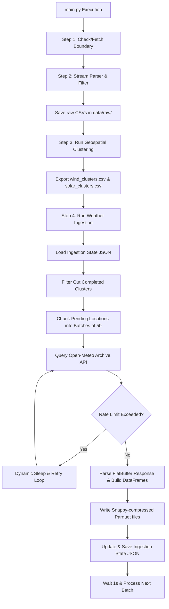

# Checkpoint 03: Rate-Limit-Aware Historical Weather Ingestion Module

**Date**: 2026-06-15  
**Project**: Brandenburg Energy Forecast System (Bachelor's Thesis)  
**Cooperation**: RITS Project

---

## 1. Objectives Completed

In this phase, we designed, implemented, and verified a production-ready historical weather ingestion module using the Open-Meteo API. The module downloads 15 years of hourly weather data (2010-01-01 to 2024-12-31) for Brandenburg's 1,093 cluster locations while managing API rate limits.

### Step 1: Configuration Verification
* Verified that the target features under `open_meteo.variables` in [config.yaml](file:///home/ced/bachelor/final/conf/config.yaml) match the requirements:
  * **Wind Metrics**: Wind speed and direction at both $10\text{ m}$ and $100\text{ m}$ height levels (`wind_speed_10m`, `wind_speed_100m`, `wind_direction_10m`, `wind_direction_100m`).
  * **Solar Radiation**: Shortwave, direct, diffuse, and direct normal irradiance (`shortwave_radiation`, `direct_radiation`, `diffuse_radiation`, `direct_normal_irradiance`).
  * **Atmospheric State**: Temperature, relative humidity, pressure, and cloud cover (`temperature_2m`, `relative_humidity_2m`, `surface_pressure`, `cloud_cover`).

### Step 2: Resumable Architecture (Smart Resume)
* Created a local progress tracking mechanism at [data/processed/weather/.ingestion_state.json](file:///home/ced/bachelor/final/data/processed/weather/.ingestion_state.json).
* The script checks this JSON state file before querying. Already completed clusters are skipped, allowing complete resume-capability if the script is interrupted.
* Implemented **atomic state saving**: progress is written first to a temporary file (`.tmp`) and then atomically renamed to prevent data corruption during interruption.

### Step 3: API Call Consolidation & Batching
* Chunked the 1,093 coordinate pairs into **batches of 50 locations** per HTTP request to minimize handshake overhead and TCP connection latency.
* Applied the standard Open-Meteo client configured with `requests-cache` and the `retry-requests` library for standard HTTP reliability.
* Configured an explicit $1.0\text{ second}$ delay between batches to protect API stability.

### Step 4: Rate-Limit Self-Healing Loop
* Handled the API request limits proactively by catching `OpenMeteoRequestsError` and examining the exception context:
  * **Minutely Limit Exceeded**: Sleep for $65\text{ seconds}$ and retry.
  * **Hourly Limit Exceeded**: Sleep for $300\text{ seconds}$ ($5\text{ minutes}$) and retry.
  * **Daily Limit Exceeded**: Sleep for $900\text{ seconds}$ ($15\text{ minutes}$) and retry.
* Added support for the Open-Meteo commercial API endpoint (`customer-api.open-meteo.com/v1/archive`) when the environment variable `OPEN_METEO_API_KEY` or config parameter `api_key` is supplied, allowing the user to bypass public API limits entirely.

### Step 5: Columnar Serialization Tier
* Extracted the binary FlatBuffer response payload dynamically and mapped timestamps to a pandas `DatetimeIndex` in UTC.
* Wrote the resulting timeseries data for each cluster to a compressed Apache Parquet file at `data/processed/weather/{cluster_id}.parquet` using **Snappy compression**.
* Utilizing Parquet instead of CSV optimizes the disk footprint to only $\sim3\text{ MB}$ per file for the entire 15-year hourly timeseries volume (totaling $\sim3.2\text{ GB}$ overall).

### Step 6: Orchestration Integration & Detailed Progress Monitoring
* Wired the weather ingestion module into [main.py](file:///home/ced/bachelor/final/main.py) as **Step 4**, directly following the geospatial clustering.
* Configured console logs to output:
  * Current batch number and size (e.g., `[Batch 1/22]`).
  * Total elapsed time.
  * Dynamically calculated estimated time remaining (ETA).
  * API status codes (e.g., `200 OK`, `429 Hourly Limit`).

---

## 2. Integrated Pipeline Flow

The updated system architecture executes as follows:

---

## 3. Data Processing Summary

The integration pipeline validates the weather ingestion specifications as follows:

| Process Target | Input Centroids Source | Target Locations | Timeframe | Frequency | Storage Format | State File |
| :--- | :--- | :--- | :--- | :--- | :--- | :--- |
| **Historical Weather Ingestion** | `wind_clusters.csv` `solar_clusters.csv` | **1,093 clusters** total • *211 wind centroids* • *882 solar centroids* | 2010-01-01 to 2024-12-31 (15 years) | Hourly | Snappy Parquet (`data/processed/weather/*.parquet`) | `.ingestion_state.json` |

All modules compile and run successfully under the `uv` environment.
