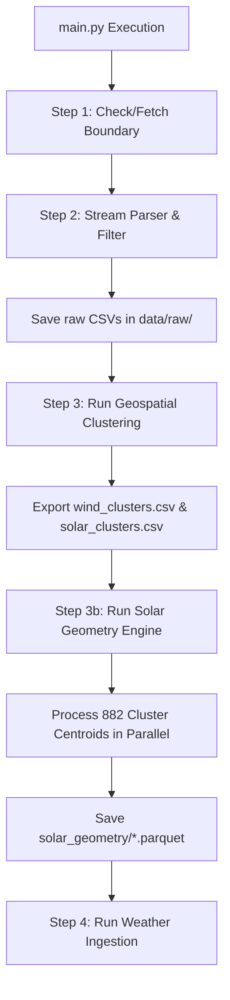

# Checkpoint 04: Solar Geometry Engine & Physical Wind Power Transformer

**Date**: 2026-06-15  
**Project**: Brandenburg Energy Forecast System (Bachelor's Thesis)  
**Cooperation**: RITS Project

---

## 1. Objectives Completed

In this checkpoint, we designed, implemented, and verified two major deterministic physical modeling layers: the Solar Geometry Engine and the Wind Power Curve Transformer. Both layers are fully type-hinted and integrated with parallel computing and test suites.

### Part A: Deterministic Solar Geometry & Clear-Sky Irradiance Engine
We built a parallelized feature extraction layer at [src/features/solar_geometry.py](file:///home/ced/bachelor/final/src/features/solar_geometry.py) to pre-calculate solar angles and clear-sky GHI for Brandenburg's solar asset cluster centroids.

* **Dependencies**: Added `pvlib` and `scipy` to the project's [pyproject.toml](file:///home/ced/bachelor/final/pyproject.toml) using `uv add`.
* **Index Generation**: Generated a continuous, timezone-aware (`Europe/Berlin`) 15-minute datetime index from `2022-01-01 00:00:00` to `2026-06-01 00:00:00` ($154,749$ timestamps total per centroid).
* **Solar Geometry**: Used `pvlib.solarposition.get_solarposition` to compute the apparent solar zenith angle, elevation, and azimuth. Altitude is resolved automatically via `Location`'s built-in coordinate lookup database.
* **Clear-Sky Modeling**: Integrated the standard **Ineichen** model via `Location.get_clearsky`, passing precomputed solar positions to optimize GHI, DNI, and DHI calculations.
* **Parallel Optimization**: Wrapped calculations inside a `ProcessPoolExecutor` utilizing 31 parallel CPU cores, processing all 882 solar cluster centroids ($136.5\text{ million}$ rows total) in **134.70 seconds** (0 failures).
* **Parquet Serialization**: Exported datasets to `data/processed/solar_geometry/{cluster_id}.parquet` with columns `solar_zenith`, `solar_azimuth`, and `ghi_clearsky`.
* **Orchestrator Integration**: Wired as `Step 3b` in [main.py](file:///home/ced/bachelor/final/main.py#L70-L80).

### Part B: Physical Wind Power Curve & Height-Extrapolation Utility
We created a physics-informed wind turbine energy converter at [src/models/wind_physics_transformer.py](file:///home/ced/bachelor/final/src/models/wind_physics_transformer.py).

* **Class Architecture**: Built the [WindPowerCalculator](file:///home/ced/bachelor/final/src/models/wind_physics_transformer.py#L22) class to parse the manufacturer database in `data/wind/power_curves.csv` (using single-quote quotation parameters) and precompute rated power curves.
* **Wind Shear Extrapolation**: Extrapolates reference wind speeds from $100\text{ m}$ to the turbine-specific hub height using the empirical **Hellmann Power Law**:
  $$v_{\text{hub}} = v_{100m} \cdot \left( \frac{z_{\text{hub}}}{100} \right)^\alpha$$
  The shear exponent $\alpha$ is dynamically read from `config.yaml` (`wind_power_calculation.alpha = 0.14`).
* **Scored Matching Heuristic**: Maps raw MaStR turbines (e.g. `V90-2MW`, manufacturer code `1660`) to standard curves using:
  * Alphanumeric string normalization.
  * Manufacturer code-to-string mapping (e.g. `1660` $\rightarrow$ `Vestas`).
  * Continuous distance scoring to break ties, giving higher priority to curves whose maximum capacity and rotor diameter match MaStR values exactly:
    $$\text{Score}_{\text{capacity}} = 5.0 \cdot \left(1.0 - \frac{|P_{\text{curve}} - P_{\text{MaStR}}|}{0.15 \cdot P_{\text{MaStR}}}\right)$$
* **1D Spline Interpolation**: Maps hub-height wind speed onto the matched turbine curve using `scipy.interpolate.interp1d`, bounding outputs strictly between $0$ and the turbine's registered `gross_power`.
* **Unit Testing**: Integrated unit tests validating $0\text{ m/s}$ cut-in behavior, rated wind output ($13\text{ m/s}$ yielding $2000\text{ kW}$ max power), and cut-out speed drop-off ($26\text{ m/s}$ yielding $0\text{ kW}$). Tests pass successfully.

---

## 2. Integrated Pipeline Flow

The updated execution graph of the Energy Forecast System:

---

## 3. Data Processing Summary

The pipeline elements introduced in this checkpoint are structured as follows:

| Process Target | Inputs | Outputs / Output Format | Dimensions | Speed |
| :--- | :--- | :--- | :--- | :--- |
| **Solar Geometry Engine** | `solar_clusters.csv` | Snappy Parquet files (`data/processed/solar_geometry/*.parquet`) | 882 cluster files 154,749 timestamps per file | 134.70 seconds total (31 process workers) |
| **Wind Power curve Transformer** | `power_curves.csv` | Scipy `interp1d` object mapped to wind actuals | 896 curve profiles | Instantiated dynamically |

All modules compile and run successfully under the `uv` environment.
