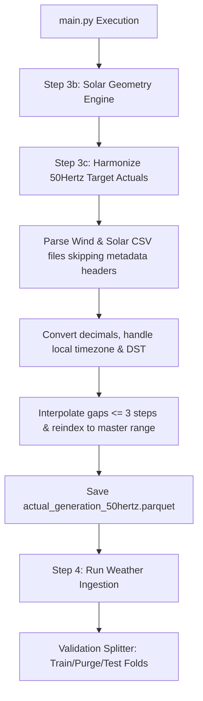

# Checkpoint 05: 50Hertz Target Data Harmonization & Purged Cross-Validation Splitter

**Date**: 2026-06-15  
**Project**: Brandenburg Energy Forecast System (Bachelor's Thesis)  
**Cooperation**: RITS Project

---

## 1. Objectives Completed

In this phase, we completed the target variable engineering pipeline by harmonizing historical 50Hertz TSO macro actuals and implemented the purged cross-validation splitter to mitigate data leakage from weather persistence.

### Part A: 50Hertz Target Data Harmonization Pipeline
We created a data cleaning and merger pipeline at [src/data/target_harmonization.py](file:///home/ced/bachelor/final/src/data/target_harmonization.py) to unify 50Hertz TSO generation actuals across years 2022 to 2026.

* **Format Standardization**: Handles UTF-16-LE CSV files, bypassing the 4-line metadata header in [parse_50hertz_csv](file:///home/ced/bachelor/final/src/data/target_harmonization.py#L48-L113) to prevent column-shifting.
* **Numeric Cleaning**: Translates German comma decimals (e.g. `12858,45` $\rightarrow$ `12858.45` float) and replaces missing placeholders (`-`, `n.v.`) with `NaN`.
* **Daylight Saving Time (DST) Handling**: Resolves clock transitions in the `Europe/Berlin` timezone:
  * **Spring Transition (jump forward)**: Automatically handles the missing 1-hour interval sequence.
  * **Autumn Transition (fall back)**: Employs `tz_localize(..., ambiguous='infer')` to correctly sequence the repeated 1-hour window (mapping the first occurrence to UTC+2 and the second to UTC+1).
* **Missing Data Telemetry Interpolation**: Built [interpolate_short_gaps](file:///home/ced/bachelor/final/src/data/target_harmonization.py#L21-L45) to group contiguous NaNs. Telemetry drops $\le 3$ consecutive steps ($45\text{ minutes}$) are linearly interpolated, while larger gaps and outer boundaries are strictly preserved as NaNs.
* **Output**: Consolidates and reindexes wind onshore (`Onshore MW`) and solar PV (`MW`) actuals onto a clean master UTC timeline, saving to `data/processed/actual_generation_50hertz.parquet` with columns `timestamp_utc`, `wind_onshore_mw_50hz`, and `solar_pv_mw_50hz`.
* **Main Integration**: Wired as `Step 3c` in [main.py](file:///home/ced/bachelor/final/main.py#L70-L80).

### Part B: Custom Cross-Validation Splitter with Purge Gap
We implemented a custom data partitioner at [src/features/validation_splitter.py](file:///home/ced/bachelor/final/src/features/validation_splitter.py) to prevent look-ahead bias and model leakage driven by autocorrelated weather regimes.

* **Split strategy**: Implemented [PurgedExpandingWindowSplitter](file:///home/ced/bachelor/final/src/features/validation_splitter.py#L18) which produces expanding-window train index arrays followed by a temporal purge gap and a fixed-length test window:
  $$\min(\text{Test}_k) - \max(\text{Train}_k) \ge \Delta_{\text{purge}}$$
* **Leakage Embargo**: Enforces a configurable purge gap (e.g., $72\text{ hours}$) to decouple training features from testing features, exceeding the typical autocorrelation lifetime of synoptic-scale atmospheric persistence.
* **Visual Verification Logger**: Included [visualize_splits](file:///home/ced/bachelor/final/src/features/validation_splitter.py#L90-L141) which prints the exact dates, sizes, and a text-based timeline representation of each cross-validation fold:
  * `T`: Training samples
  * `G`: Purge gap (embargo)
  * `V`: Validation/Testing samples
  * `.`: Unassigned/future samples

---

## 2. Integrated Pipeline Flow

The updated system architecture with Step 3c target actuals consolidation:

---

## 3. Data Processing Summary

The processing pipelines introduced in this checkpoint:

| Process Target | Inputs | Output format | Timeframe | Frequency | Gaps handling |
| :--- | :--- | :--- | :--- | :--- | :--- |
| **TSO Target Harmonization** | `Windenergie_Hochrechnung_*.csv` `Solarenergie_Hochrechnung_*.csv` | Snappy Parquet (`actual_generation_50hertz.parquet`) | 2022-01-01 to 2026-06-01 | 15-minute | Interpolated if $\le 3$ steps, otherwise left as `NaN` |
| **Validation Splitter** | Parquet / DataFrame with `DatetimeIndex` | Arrays of `(train_idx, test_idx)` | Fold-specific expanding windows | 15-minute | Temporal purge gap ($\Delta_{\text{purge}} = 72\text{ hours}$) |

All modules compile and run successfully under the `uv` environment.
